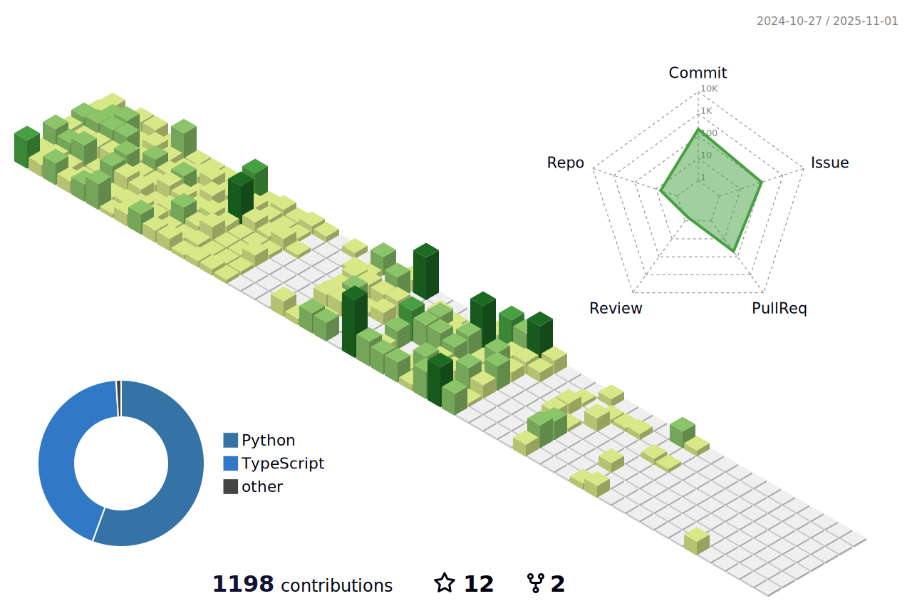

### Welcome to RikitoNoto's Profile
```python
class RikitoNoto(Programmer):
    def __init__(self):
      self.languages = ["C/C++","Python","Dart","Ruby","JS/TS"]
      self.frameworks = ["Django","Flutter","Vue","RubyOnRails"]
      self.infrastructure = ["AWS"]


    def where_am_i_from() -> str:
      return "Japan"

    def what_is_my_job() -> str:
      return "Web Engineer"

    def my_career(self, current_year: int) -> list[str]:
      career: list[str] = [""] * current_year
      for year in range(2016, 2023):
        career[year] = "Electrical engineer & Embedded engineer"

      for year in range(2023, current_year):
        career[year] = "Web engineer(front,backend,infra)"
      return career
```

## My Projects

<table>
  <thead align="center">
    <tr border: none;>
      <td><b>🔭 Name</b></td>
      <td><b>🏞️ Icon</b></td>
      <td><b>💬 Summary</b></td>
    </tr>
  </thead>
  <tbody>
    <tr>
      <td><a href="https://github.com/RikitoNoto/GanttKit">GanttKit</a></td>
      <td></td>
      <td>
          A Rails Web App.</br>
          This app allows you to construct a schedule that be used Gantt chart easily.
      </td>
    </tr>
    <tr>
      <td><a href="https://github.com/RikitoNoto/silkroad">SilkRoad</a></td>
      <td><image src="assets/silk_road_logo_req.png" height=50px/></td>
      <td>
        A Flutter App.</br>
        This app allows you to transport files and images between multiple platforms easily.
      </td>
    </tr>
    <tr>
      <td><a href="https://github.com/RikitoNoto/camel">Camel</a></td>
      <td><image src="assets/camel_logo.png" height=50px/></td>
      <td>
        A Flutter library.</br>
        this library allows you to transport the data between local networks.
      </td>
    </tr>
    <tr>
      <td><a href="https://github.com/RikitoNoto/flutter_animated_icon_button?tab=readme-ov-file">flutter_animated_icon_button</a></td>
      <td><image src="assets/animate_icon_push.gif" height=50px max-width=200px /></td>
      <td>
        A Flutter package.</br>
        This package allows you to create animated icons easily.
      </td>
    </tr>
    <tr>
      <td><a href="https://github.com/RikitoNoto/japanese-school-parser">japanese-school-parser</a></td>
      <td></td>
      <td>
        文部科学省が公開している大学一覧のエクセルファイルをパースし、jsonやpythonのデータとして出力するライブラリです。
      </td>
    </tr>
  </tbody>
</table>


<!-- [](https://github.com/vn7n24fzkq/github-profile-summary-cards) -->
<!-- [](https://github.com/vn7n24fzkq/github-profile-summary-cards) [](https://github.com/vn7n24fzkq/github-profile-summary-cards) -->
<!-- [](https://github.com/vn7n24fzkq/github-profile-summary-cards) [](https://github.com/vn7n24fzkq/github-profile-summary-cards) -->

<!--
**RikitoNoto/RikitoNoto** is a ✨ _special_ ✨ repository because its `README.md` (this file) appears on your GitHub profile.

Here are some ideas to get you started:

- 🔭 I’m currently working on ...
- 🌱 I’m currently learning ...
- 👯 I’m looking to collaborate on ...
- 🤔 I’m looking for help with ...
- 💬 Ask me about ...
- 📫 How to reach me: ...
- 😄 Pronouns: ...
- ⚡ Fun fact: ...
-->
